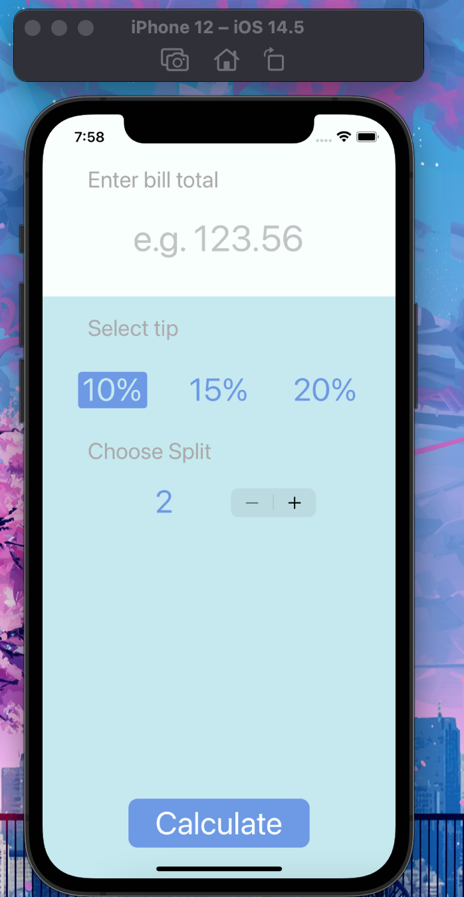
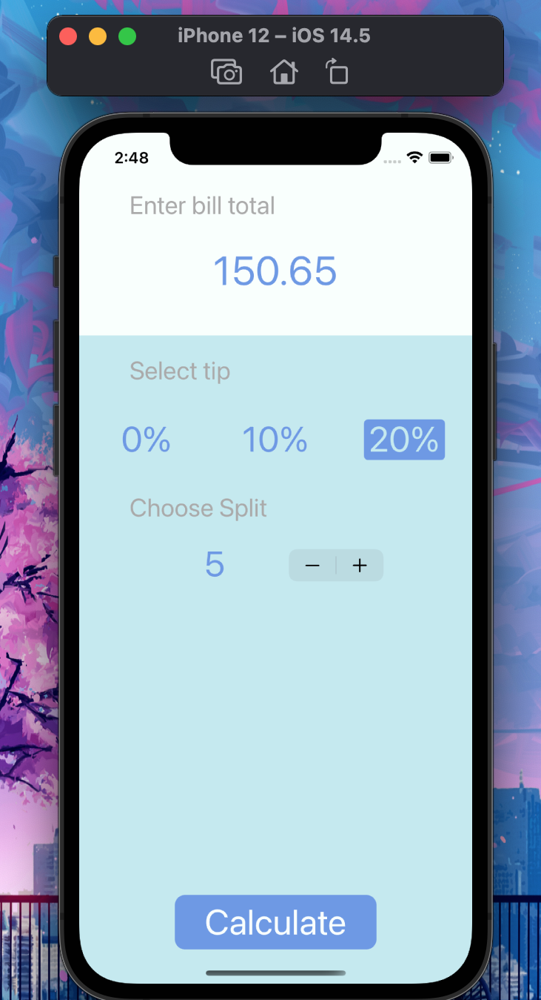
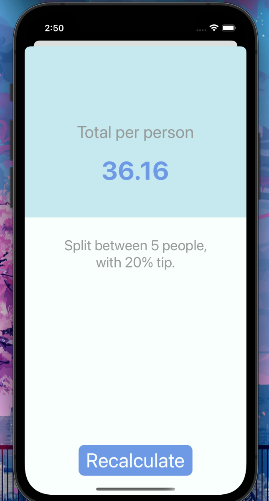

# iOSTipCalculator - Tipsy
Tipsy is a Bill Calculator app which allows users to calculate a 'per person total' from a  

### How it works

- a user to enter a total amount of their bill
- User selects tip percentage
- Choose how many people you need to split between
- After all selections are made hit calculate 
- Per person total is shown on results screen with details of it was derived. 

## Calculate Screen 

## User Entry and Selection 

## Results Screen 

